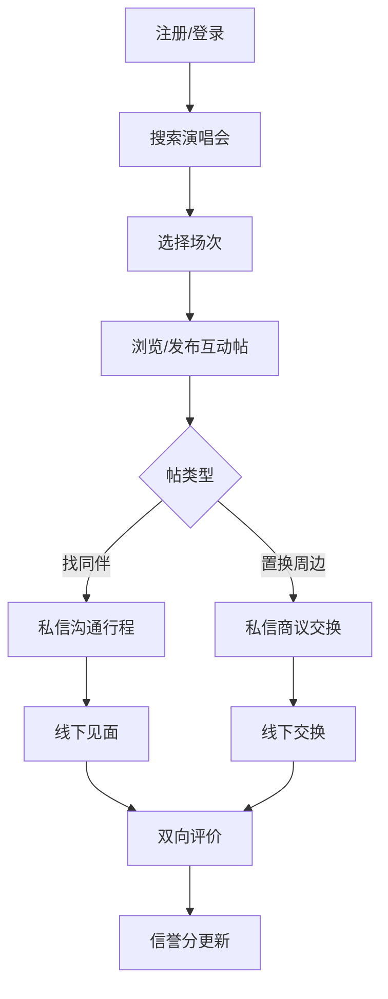

## 1. 产品概述

演唱会粉丝互动平台——一个面向演唱会爱好者的全栈社交应用，旨在解决粉丝在演唱会场景下的"找同伴难"与"周边置换难"两大核心痛点。用户可通过歌手名称或演出城市精准检索演唱会场次，在具体场次下发布寻找同行伙伴或置换闲置官方周边的互动帖，并通过一对一私信沟通落实行程与交换细节，交易完成后双向打分评价以建立社区信任体系。

- 目标用户：有演唱会出行需求的年轻粉丝群体（18-35岁）
- 核心价值：连接同场次粉丝、降低周边置换信息差、建立可信的粉丝互动生态

## 2. 核心功能

### 2.1 用户角色

| 角色 | 注册方式 | 核心权限 |
|------|----------|----------|
| 普通用户 | 邮箱注册 | 浏览演唱会、发帖、私信、评价 |
| 未登录访客 | 无 | 仅可浏览演唱会列表与帖子 |

### 2.2 功能模块

1. **登录/注册页**：邮箱注册、登录、JWT鉴权
2. **首页**：演唱会搜索（歌手/城市）、热门场次推荐
3. **演唱会详情页**：场次信息、互动帖列表（找同伴/置换周边）
4. **发帖页**：在选定场次下发布找同伴或置换周边帖
5. **帖子详情页**：帖子内容、评论、私信发起
6. **私信页**：一对一私密通讯对话列表与聊天窗口
7. **个人中心页**：个人资料、我的帖子、我的评价、信誉分
8. **评价页**：双向打分（1-5星）与文字评价提交

### 2.3 页面详情

| 页面名称 | 模块名称 | 功能描述 |
|----------|----------|----------|
| 登录/注册页 | 注册表单 | 邮箱、用户名、密码注册，表单校验 |
| 登录/注册页 | 登录表单 | 邮箱+密码登录，JWT Token返回 |
| 首页 | 搜索栏 | 输入歌手名称或城市名称实时搜索演唱会 |
| 首页 | 热门场次卡片 | 展示近期热门演唱会，点击进入详情 |
| 演唱会详情页 | 场次信息 | 演唱会名称、时间、地点、海报 |
| 演唱会详情页 | 互动帖Tab | 找同伴帖列表 / 置换周边帖列表，Tab切换 |
| 演唱会详情页 | 发帖按钮 | 跳转发帖页，选择帖类型 |
| 发帖页 | 表单 | 帖类型选择、标题、内容描述、联系方式 |
| 帖子详情页 | 帖子内容 | 发布者信息、帖内容、发布时间 |
| 帖子详情页 | 私信按钮 | 点击进入与发布者的一对一私信 |
| 私信页 | 对话列表 | 展示所有私信对话，最新消息预览 |
| 私信页 | 聊天窗口 | 消息输入、发送、实时消息列表 |
| 个人中心页 | 个人资料 | 头像、昵称、信誉分展示 |
| 个人中心页 | 我的帖子 | 我发布的互动帖管理 |
| 个人中心页 | 我的评价 | 收到的评价与发出的评价 |
| 评价页 | 打分组件 | 星级评分（1-5星）+ 文字评价输入 |

## 3. 核心流程

### 3.1 用户找同伴流程
用户注册登录 → 搜索演唱会（歌手/城市） → 进入场次详情 → 浏览找同伴帖 / 发布找同伴帖 → 私信沟通 → 线下见面 → 双向评价

### 3.2 周边置换流程
用户注册登录 → 搜索演唱会 → 进入场次详情 → 浏览置换周边帖 / 发布置换帖 → 私信商议交换细节 → 线下交换 → 双向评价

## 4. 用户界面设计

### 4.1 设计风格

- **主色调**：深色霓虹风格 — 主色 #E91E63（品红霓虹），辅色 #00BCD4（青色霓虹），背景 #0A0A1A（深夜蓝黑）
- **按钮风格**：圆角胶囊按钮，霓虹发光边框效果，hover时光晕增强
- **字体**：标题使用 Orbitron（科技感显示字体），正文使用 Noto Sans SC（中文正文）
- **布局风格**：卡片式布局，顶部导航栏，玻璃态（Glassmorphism）卡片效果
- **图标风格**：线性霓虹风格图标，Lucide Icons
- **整体风格**：演唱会夜场氛围 — 暗色背景、霓虹光效、渐变光晕、动态粒子

### 4.2 页面设计概述

| 页面名称 | 模块名称 | UI元素 |
|----------|----------|--------|
| 登录/注册页 | 表单区域 | 深色卡片居中、霓虹边框输入框、渐变CTA按钮、背景粒子动画 |
| 首页 | 搜索栏 | 全宽搜索框、霓虹聚焦发光、歌手/城市Tab切换 |
| 首页 | 热门场次卡片 | 玻璃态卡片、海报缩略图、霓虹标题、悬浮光晕效果 |
| 演唱会详情页 | 场次信息 | 大海报背景模糊、信息叠加层、渐变遮罩 |
| 演唱会详情页 | 互动帖列表 | 玻璃态帖子卡片、类型标签（品红/青色）、悬浮上浮动画 |
| 发帖页 | 表单 | 深色表单、类型选择器（品红=找同伴/青色=置换）、富文本输入 |
| 私信页 | 对话列表 | 头像+最新消息、未读红点、滑动删除 |
| 私信页 | 聊天窗口 | 气泡消息、发送方品红/接收方青色、输入框底部固定 |
| 个人中心页 | 个人资料 | 霓虹光环头像、信誉分星标、渐变卡片统计 |
| 评价页 | 打分组件 | 可点击星星、霓虹高亮、渐变提交按钮 |

### 4.3 响应式设计

- 桌面优先设计，最大宽度1440px居中
- 平板（768-1024px）：卡片双列布局，私信页左右分栏
- 手机（<768px）：卡片单列，私信页切换对话列表与聊天窗口，底部Tab导航

### 4.4 3D场景指引

不适用
