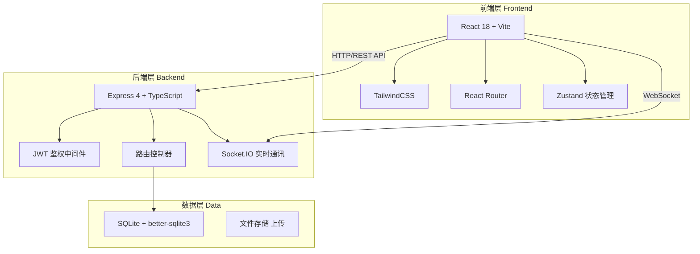
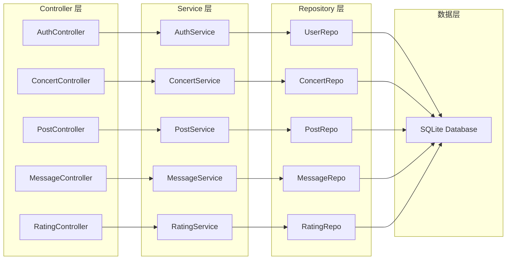
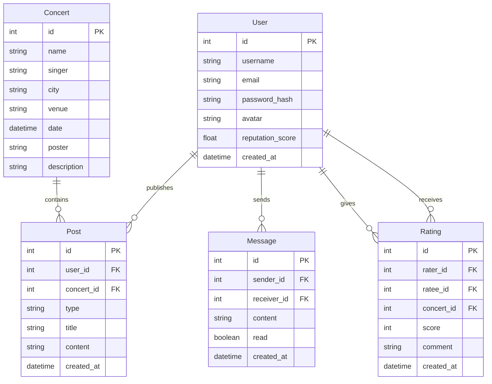

## 1. 架构设计



## 2. 技术说明

- **前端**：React@18 + TailwindCSS@3 + Vite + TypeScript
- **初始化工具**：Vite (react-ts template)
- **后端**：Express@4 + TypeScript + Socket.IO
- **数据库**：SQLite (better-sqlite3)，零配置本地数据库
- **鉴权**：JWT (jsonwebtoken)，Bearer Token
- **实时通讯**：Socket.IO，一对一私信实时推送
- **状态管理**：Zustand，轻量级前端状态管理
- **路由**：React Router v6

## 3. 路由定义

| 路由 | 用途 |
|------|------|
| `/login` | 登录页面 |
| `/register` | 注册页面 |
| `/` | 首页，演唱会搜索与推荐 |
| `/concert/:id` | 演唱会详情页，含互动帖列表 |
| `/concert/:id/post` | 发帖页 |
| `/post/:id` | 帖子详情页 |
| `/messages` | 私信对话列表 |
| `/messages/:userId` | 与某用户的一对一聊天窗口 |
| `/profile` | 个人中心 |
| `/profile/:userId` | 他人的个人主页 |
| `/rate/:userId` | 评价用户页 |

## 4. API 定义

### 4.1 鉴权相关

```typescript
// POST /api/auth/register
interface RegisterRequest {
  email: string;
  username: string;
  password: string;
}
interface RegisterResponse {
  token: string;
  user: { id: number; username: string; email: string };
}

// POST /api/auth/login
interface LoginRequest {
  email: string;
  password: string;
}
interface LoginResponse {
  token: string;
  user: { id: number; username: string; email: string };
}

// GET /api/auth/me
interface MeResponse {
  id: number;
  username: string;
  email: string;
  avatar: string | null;
  reputationScore: number;
}
```

### 4.2 演唱会相关

```typescript
// GET /api/concerts?keyword=xxx&type=singer|city
interface Concert {
  id: number;
  name: string;
  singer: string;
  city: string;
  venue: string;
  date: string;
  poster: string;
  description: string;
}
interface ConcertListResponse {
  concerts: Concert[];
  total: number;
}

// GET /api/concerts/:id
interface ConcertDetailResponse {
  concert: Concert;
  postCount: { companion: number; merch: number };
}
```

### 4.3 互动帖相关

```typescript
// GET /api/concerts/:id/posts?type=companion|merch&page=1&limit=10
interface Post {
  id: number;
  type: "companion" | "merch";
  title: string;
  content: string;
  authorId: number;
  authorName: string;
  authorAvatar: string | null;
  concertId: number;
  createdAt: string;
}
interface PostListResponse {
  posts: Post[];
  total: number;
}

// POST /api/concerts/:id/posts
interface CreatePostRequest {
  type: "companion" | "merch";
  title: string;
  content: string;
}

// GET /api/posts/:id
interface PostDetailResponse {
  post: Post & { author: User };
}
```

### 4.4 私信相关

```typescript
// GET /api/messages/conversations
interface Conversation {
  partnerId: number;
  partnerName: string;
  partnerAvatar: string | null;
  lastMessage: string;
  lastMessageAt: string;
  unreadCount: number;
}

// GET /api/messages/:userId?page=1&limit=50
interface Message {
  id: number;
  senderId: number;
  receiverId: number;
  content: string;
  createdAt: string;
  read: boolean;
}
interface MessageListResponse {
  messages: Message[];
}

// POST /api/messages/:userId
interface SendMessageRequest {
  content: string;
}

// Socket.IO 事件
interface ChatEvents {
  "private:message": (data: { to: number; content: string }) => void;
  "private:message:received": (data: Message) => void;
}
```

### 4.5 评价相关

```typescript
// POST /api/users/:userId/ratings
interface CreateRatingRequest {
  score: number; // 1-5
  comment: string;
  concertId?: number;
}
interface CreateRatingResponse {
  rating: { id: number; score: number; comment: string };
}

// GET /api/users/:userId/ratings?page=1&limit=10
interface RatingListResponse {
  ratings: Array<{
    id: number;
    score: number;
    comment: string;
    raterId: number;
    raterName: string;
    raterAvatar: string | null;
    createdAt: string;
  }>;
  averageScore: number;
  totalRatings: number;
}
```

## 5. 服务端架构图



## 6. 数据模型

### 6.1 数据模型定义



### 6.2 数据定义语言

```sql
CREATE TABLE users (
    id INTEGER PRIMARY KEY AUTOINCREMENT,
    username TEXT NOT NULL UNIQUE,
    email TEXT NOT NULL UNIQUE,
    password_hash TEXT NOT NULL,
    avatar TEXT,
    reputation_score REAL DEFAULT 5.0,
    created_at TEXT DEFAULT (datetime('now'))
);

CREATE TABLE concerts (
    id INTEGER PRIMARY KEY AUTOINCREMENT,
    name TEXT NOT NULL,
    singer TEXT NOT NULL,
    city TEXT NOT NULL,
    venue TEXT NOT NULL,
    date TEXT NOT NULL,
    poster TEXT,
    description TEXT
);

CREATE TABLE posts (
    id INTEGER PRIMARY KEY AUTOINCREMENT,
    user_id INTEGER NOT NULL REFERENCES users(id),
    concert_id INTEGER NOT NULL REFERENCES concerts(id),
    type TEXT NOT NULL CHECK(type IN ('companion', 'merch')),
    title TEXT NOT NULL,
    content TEXT NOT NULL,
    created_at TEXT DEFAULT (datetime('now'))
);

CREATE TABLE messages (
    id INTEGER PRIMARY KEY AUTOINCREMENT,
    sender_id INTEGER NOT NULL REFERENCES users(id),
    receiver_id INTEGER NOT NULL REFERENCES users(id),
    content TEXT NOT NULL,
    read INTEGER DEFAULT 0,
    created_at TEXT DEFAULT (datetime('now'))
);

CREATE TABLE ratings (
    id INTEGER PRIMARY KEY AUTOINCREMENT,
    rater_id INTEGER NOT NULL REFERENCES users(id),
    ratee_id INTEGER NOT NULL REFERENCES users(id),
    concert_id INTEGER REFERENCES concerts(id),
    score INTEGER NOT NULL CHECK(score BETWEEN 1 AND 5),
    comment TEXT,
    created_at TEXT DEFAULT (datetime('now')),
    UNIQUE(rater_id, ratee_id, concert_id)
);

CREATE INDEX idx_posts_concert ON posts(concert_id, type);
CREATE INDEX idx_posts_user ON posts(user_id);
CREATE INDEX idx_messages_pair ON messages(sender_id, receiver_id);
CREATE INDEX idx_messages_receiver_unread ON messages(receiver_id, read);
CREATE INDEX idx_ratings_ratee ON ratings(ratee_id);
CREATE INDEX idx_concerts_singer ON concerts(singer);
CREATE INDEX idx_concerts_city ON concerts(city);
```
